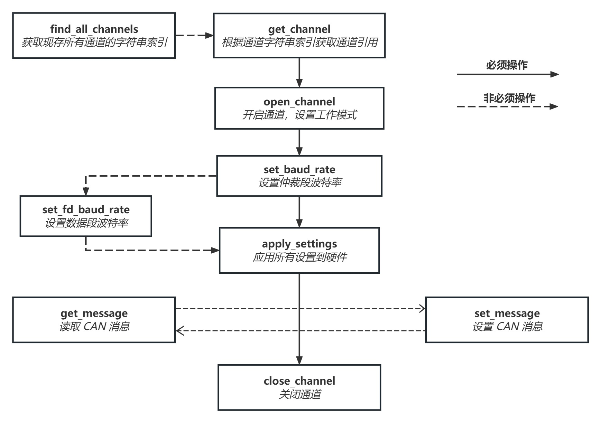

## 构建文档
[API documentation](./doc/_build/html/index.html)
```shell
# requirements
pip install sphinx
pip install sphinx_rtd_theme
```

```shell
# python_itican/
 sphinx-apidoc -M -F -o doc  .\iticanwrapper
```

```python
# edit python_itican/doc/conf.py

# add contents ahead .py file

import os
import sys
sys.path.insert(0, os.path.abspath('..'))


# change file tail
html_theme = 'sphinx_rtd_theme'
```

```shell
# /python_itican/doc
./make html
```

## 使用流程

